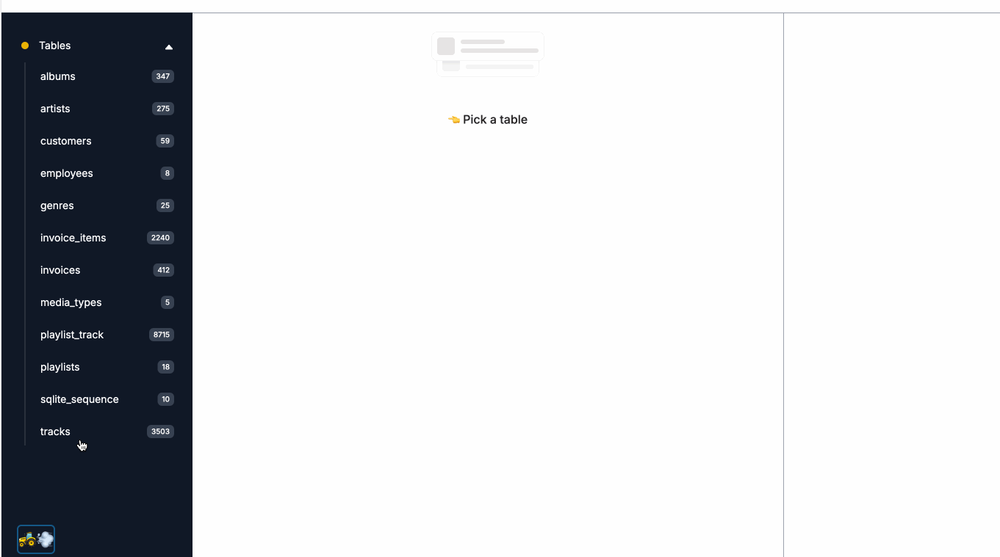

<div align="center">
  🚜💨
</div>

<h1 align="center">FastHTML Tractor</h1>




SQLite3 DB explorer plugin for FastHTML apps. 

> Note: this is a side project of my other side project lol. Very much experimental weekend hack. You have been warned

## Installation 

`poetry add git+https://github.com/callmephilip/fasthtml-tractor.git`

or `pip install git+https://github.com/callmephilip/fasthtml-tractor.git`

## Connect to your app

```python
from fasthtml.common import *
from tractor import connect_tractor

app = FastHTMLWithLiveReload(
    hdrs=(picolink,
        Style(':root { --pico-font-size: 100%; }'), SortableJS('.sortable')
    )
)
rt = app.route
db = database('data/YOURDB.db')

connect_tractor(app, db.conn)

@rt('/')
def get(): return Div(P('Hello World!'))

serve()

```
